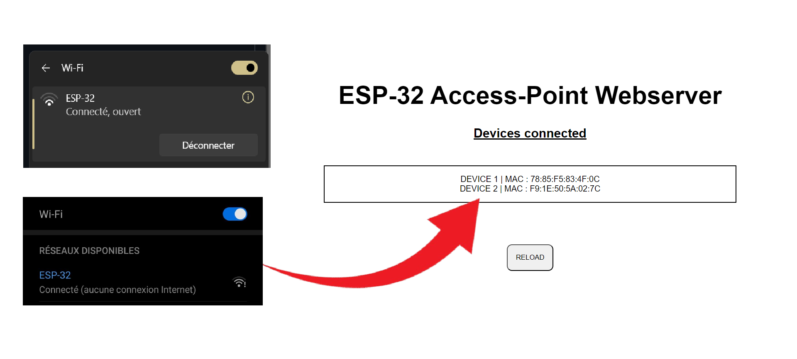

# Projet Arduino - ESP32 Access-Point Webserver

## Fonctionnalités
Ce projet Arduino réalisé depuis l'IDE VSCode/PlatformIO permet de :
- Créer un point d'accès mobile
- Créer un Webserveur sur le port 192.168.4.1
- Charger un projet web grâce aux SPIFFS
- Récupérer les adresses MAC des appareils connectés au point d'accès

## Compléments
Des leds peuvent être installées sur ce projet :
- Une led *(PIN 26)* qui s'allume si un appareil se connecte au point d'accès
- Une led *(PIN 14)* qui s'allume si un appareil se déconnecte du point d'accès
Ces deux signaux lumineux s'éteignent si on recharge la page web avec le bouton "reload"

## Installation
- Tuto installation VSCode/PlatformIO : https://randomnerdtutorials.com/vs-code-platformio-ide-esp32-esp8266-arduino/
- Tuto installation/utilisation des SPIFFS : https://randomnerdtutorials.com/esp32-vs-code-platformio-spiffs/

